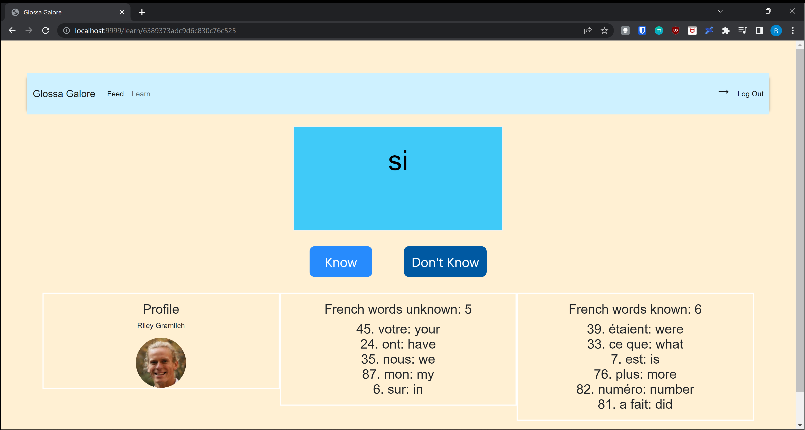
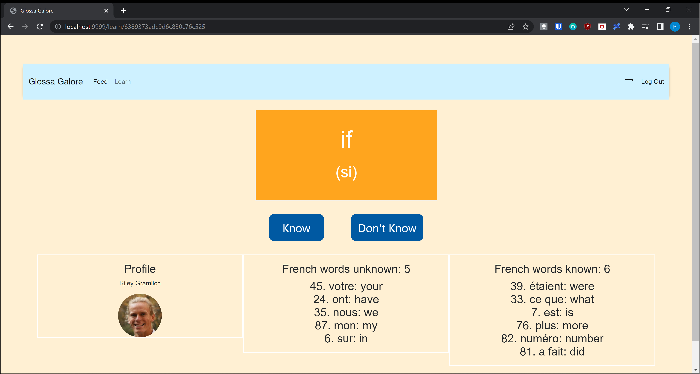
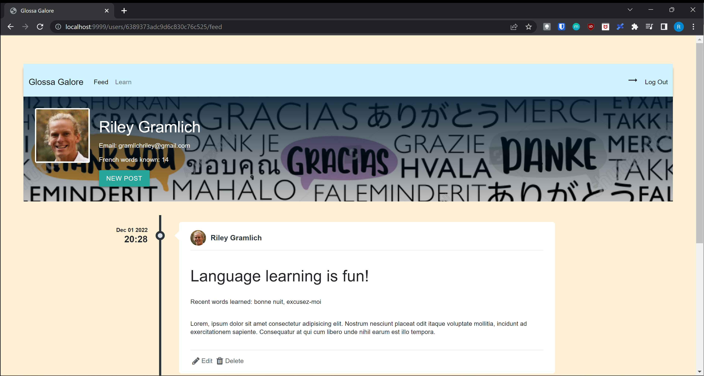
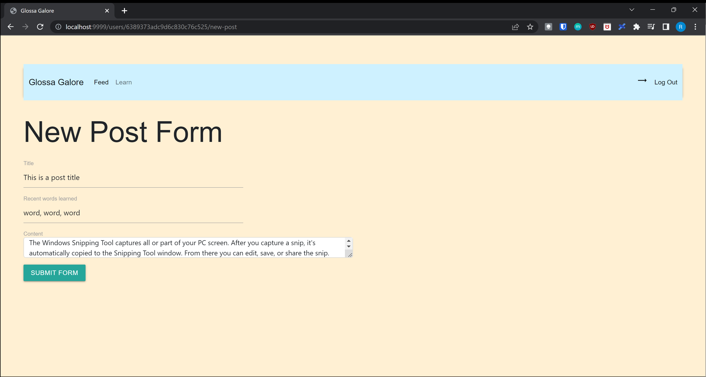
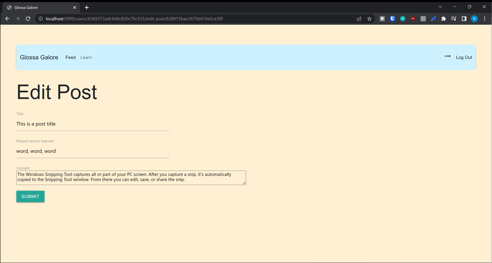
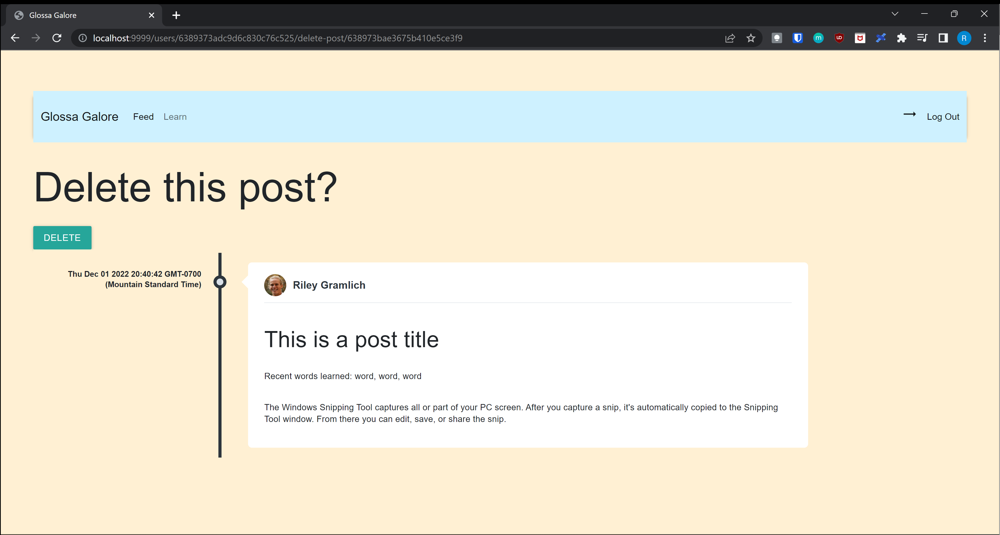
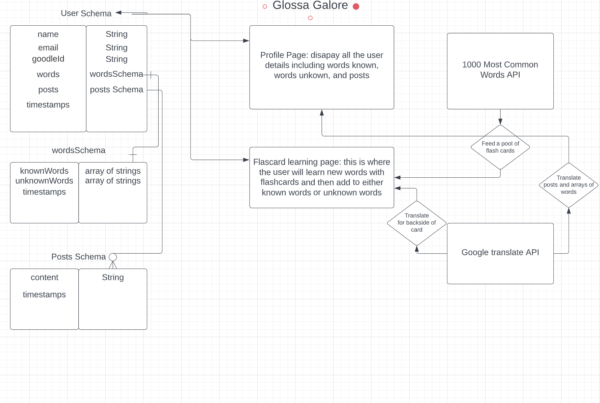

# Glossa Galore
### A language learning web-app that accelerates your vocabulary in other languages.

#### By [rileygramlich](https://github.com/rileygramlich)
---

## Description and Background Info:
This utility app is built with the intention of helping people learn more words in other languages by using a flashcard learning technique.

### Learn:
A usuer can go to the 'Learn' page to be prompted flashcards in the language of their choosing, and thereafter will be prompted a shuffled words from a bank of the commonly used words.  The user then can either click on 'Know' if they know the word which adds it into their progress of known vocabulary and renders it to the screen; or if they do not know the word, they can hover the mouse over the flashcard which reveals to them the translation as well as the original word they are trying to learn underneath in brackets. Get learning to build up your vocab!

### Feed:
If a user clicks on the 'Feed' option in the nav bar, they will be prompted with a display of their profile infomation and a timeline of their past posts.  Here the user has an option to create a post and fill out a form that takes a title, recent words learned, and the post content where the user is encouraged to integrate the words they just learned.  On the feed page, the user has the ability to click on the edit button for a post which brings them to an edit post page, and resubmits the edited version.  Or, if they wish, they can delete the post entirely by clicking which brings them to a confirmation page to see if they are sure about deleting it.

## Screenshots:
Of make a post form:

Of make a edit form:

Of delete form:

## Technologies Used:
The MEN (MongoDB, Express, Node.js) stack was used to develop this full-stack web application.

* [MongoDB](https://www.mongodb.com/): used to deploy a live cloud server to store data in a database. User model with mongoose referencing for the known and known words (many to many), and mongoose embedding for the posts (one to many).

* [Express](https://expressjs.com/): used for handling all of the back-end operations (routing, schema data manipulation, and so on).

* [Node.js](https://nodejs.org/en/): used as the live server environment, to monitor server operations, and view the web-app in a browser when running nodemon.

* [DEEPL API](https://www.deepl.com/en/docs-api): used as the third party API to make translations in the back-end.

* [Google People API](https://console.cloud.google.com/): used as a third party API to make Oauthentication with Google possible and bring in Google user data.

* Javascript: used constantly throughout the application to write functions and manipulate the data accordingly.

* EJS: used for rendering webpages to the user with embedded javascript display important data like the word on the flash card, or their profile information.

* CSS (including bootstrap and materialize libraries): used to style the app and make it look clean and pretty.

* Top 1000 words used in Englith list: https://gist.github.com/deekayen/4148741

* [Github](https://github.com/): used to make commits and have backups and to track the progress of the app.

* [VSCode Editor](https://code.visualstudio.com/): used to write and code and manage file locations.

* [Railway](https://railway.app/): used for deploying the app for others to use. Use now: [link to app]

* [Trello](https://trello.com/u/rileygramlich1/boards): was used for making a do list list and managing tasks to get done.

* [Lucid](https://lucid.app/documents): used to create an initial ERD (environment relationship diagram.

* [WriteOrDie2](https://v2.writeordie.com/) was used as a word processer to write this README.md

* Markdown: used to create this README.md

* Microsoft paint was used to create the original wireframe.

* Google Chrome and its developer tools was used to test the app during production.

## Getting Started: 

### Demo:
[Click to learn other languages now!](https://glossagalore.up.railway.app/)

## Next Steps: Planned future enhancements:
1. More languages integration
2. Allow the user to choose how big of a word bank they want their flashcards to shuffle
3. To not show words on the flashcard that is in the user's known words list
4. Add the feature that if prompted a word that is in the user's 'Don't know' list, and is now added to 'Know', have it removed from the 'Don't know' list
5. Add ability to remove words from known words or unknown words lists on Learn page
6. Add prompt after flashcard session to write a post, and integrate the recently learned words.
7. Post the post in both languages together
8. Add ability to make, edit, and delete comments on posts that show comments in both languages for that post
9. Add social network ability where you can make connections with others and have their posts be in your feed
10. Add in About page for more info and help if needed, and donation option
11. Add customizability features to change timeline photo or colors used or profile pic if they wanted to user something else other than their google avatar
12. Add more stats features: flashcards seen, date since learning x language
13. Add share feature for the app, as well as for sharing individual posts or sharing user pages
